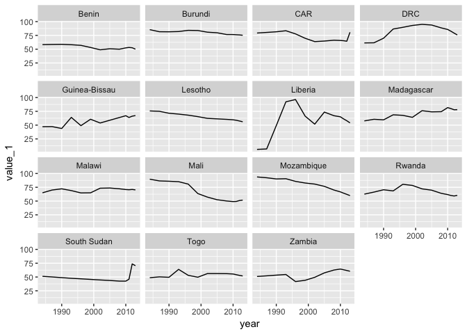

Percentage of Population Living Under 2011 PPP$ 1.90 per Day
================

``` r
library(tidyverse)
```

    ## Loading tidyverse: ggplot2
    ## Loading tidyverse: tibble
    ## Loading tidyverse: tidyr
    ## Loading tidyverse: readr
    ## Loading tidyverse: purrr
    ## Loading tidyverse: dplyr

    ## Conflicts with tidy packages ----------------------------------------------

    ## filter(): dplyr, stats
    ## lag():    dplyr, stats

Percentage of Population Living Under 2011 PPP$ 1.90 per Day
============================================================

Data import
-----------

Data downloaded from <https://apihighways.org/data-sets/6a6de0b8-e544-495a-93ab-e8bc3c59fb20>

``` r
df <- read_csv("./data/poverty-190/csv/poverty-190.csv")
```

    ## Parsed with column specification:
    ## cols(
    ##   id = col_character(),
    ##   `entity-name` = col_character(),
    ##   year = col_integer(),
    ##   `value-1` = col_double(),
    ##   `value-2` = col_double(),
    ##   `value-3` = col_double()
    ## )

``` r
df                                                         # 3900 rows : 30 years x 130 countries
```

    ## # A tibble: 3,900 x 6
    ##       id `entity-name`  year `value-1` `value-2` `value-3`
    ##    <chr>         <chr> <int>     <dbl>     <dbl>     <dbl>
    ##  1    AL       Albania  1984      0.06      0.06      0.06
    ##  2    AL       Albania  1985      0.06      0.06        NA
    ##  3    AL       Albania  1986      0.06      0.06        NA
    ##  4    AL       Albania  1987      0.06      0.06      0.06
    ##  5    AL       Albania  1988      0.08      0.08        NA
    ##  6    AL       Albania  1989      0.09      0.09        NA
    ##  7    AL       Albania  1990      0.11      0.11      0.11
    ##  8    AL       Albania  1991      0.21      0.21        NA
    ##  9    AL       Albania  1992      0.31      0.31        NA
    ## 10    AL       Albania  1993      0.41      0.41      0.41
    ## # ... with 3,890 more rows

``` r
entity <- read_csv("./data/poverty-190/csv/entity.csv")
```

    ## Parsed with column specification:
    ## cols(
    ##   id = col_character(),
    ##   type = col_character(),
    ##   `long-name` = col_character(),
    ##   region = col_character(),
    ##   `iso-alpha-2` = col_character(),
    ##   `iso-alpha-3` = col_character(),
    ##   neighbors = col_character(),
    ##   `income-group` = col_character(),
    ##   slug = col_character(),
    ##   `dac-id` = col_character(),
    ##   `donor-recipient-type` = col_character(),
    ##   `has-domestic-data` = col_integer(),
    ##   name = col_character()
    ## )

``` r
entity
```

    ## # A tibble: 333 x 13
    ##                  id         type                     `long-name`
    ##               <chr>        <chr>                           <chr>
    ##  1  adaptation-fund organisation                 Adaptation Fund
    ##  2               AF      country                     Afghanistan
    ##  3           africa       region                Africa, regional
    ##  4             afdb organisation African Development Bank (AfDB)
    ##  5             afdf organisation African Development Fund (AfDF)
    ##  6               AX      country                   Åland Islands
    ##  7               AL      country                         Albania
    ##  8               DZ      country                         Algeria
    ##  9 all-donors-total         <NA>               All Donors, Total
    ## 10          america       region               America, regional
    ## # ... with 323 more rows, and 10 more variables: region <chr>,
    ## #   `iso-alpha-2` <chr>, `iso-alpha-3` <chr>, neighbors <chr>,
    ## #   `income-group` <chr>, slug <chr>, `dac-id` <chr>,
    ## #   `donor-recipient-type` <chr>, `has-domestic-data` <int>, name <chr>

Data cleaning : Headings
------------------------

``` r
# r interprets a variable containing a 'minus sign' as an expression. So (for `df`) need to change column headings `value-1`, `value-2`, `value-3`. And to be able to do that, need to surround them with ticks

df <- df %>% dplyr::rename(entity_name = `entity-name`, value_1 = `value-1`, value_2 = `value-2`, value_3 = `value-3`)

entity <- entity %>% dplyr::rename(long_name = `long-name`, iso_alpha_2 = `iso-alpha-2`, iso_alpha_3 = `iso-alpha-3`, income_group = `income-group`, dac_id = `dac-id`, donor_recipient_type = `donor-recipient-type`, has_domestic_data = `has-domestic-data`)
```

Basic EDA
---------

``` r
df %>% count(id)                    # 130 rows
```

    ## # A tibble: 130 x 2
    ##       id     n
    ##    <chr> <int>
    ##  1    AL    30
    ##  2    AM    30
    ##  3    AO    30
    ##  4    AZ    30
    ##  5    BA    30
    ##  6    BD    30
    ##  7    BF    30
    ##  8    BG    30
    ##  9    BI    30
    ## 10    BJ    30
    ## # ... with 120 more rows

``` r
df %>% filter(is.na(value_1))       # 6 rows (Solomon Islands : 1984-1989)
```

    ## # A tibble: 6 x 6
    ##      id     entity_name  year value_1 value_2 value_3
    ##   <chr>           <chr> <int>   <dbl>   <dbl>   <dbl>
    ## 1    SB Solomon Islands  1984      NA      NA      NA
    ## 2    SB Solomon Islands  1985      NA      NA      NA
    ## 3    SB Solomon Islands  1986      NA      NA      NA
    ## 4    SB Solomon Islands  1987      NA      NA      NA
    ## 5    SB Solomon Islands  1988      NA      NA      NA
    ## 6    SB Solomon Islands  1989      NA      NA      NA

``` r
entity %>% count(id)                # 333 rows (assume the 130 countries in `df` and 203 'other')
```

    ## # A tibble: 333 x 2
    ##                 id     n
    ##              <chr> <int>
    ##  1              AD     1
    ##  2 adaptation-fund     1
    ##  3              AE     1
    ##  4              AF     1
    ##  5            afdb     1
    ##  6            afdf     1
    ##  7           afesd     1
    ##  8          africa     1
    ##  9              AG     1
    ## 10              AI     1
    ## # ... with 323 more rows

``` r
entity %>% count(id) %>% count(n)   # 1 row (ie. there were no duplications in the 333 rows)
```

    ## # A tibble: 1 x 2
    ##       n    nn
    ##   <int> <int>
    ## 1     1   333

``` r
entity %>% count(type)
```

    ## # A tibble: 4 x 2
    ##           type     n
    ##          <chr> <int>
    ## 1      country   252
    ## 2 organisation    49
    ## 3       region    18
    ## 4         <NA>    14

Column names in `df` :

-   `id` <chr> : country (130 of them)
-   `entity_name` <chr> : country (130 of them)
-   `year` <int> : year (30, from 1984-2013)
-   `value_1` <dbl> : presumably Percentage of Population (with 10% shown as 10, not 0.1)
-   `value_2` <dbl> : same as `value_1`
-   `value_3` <dbl> : same as `value_1`, except it has 2212 missing values (instead of 6)

Column names in `entity` :

-   `id` <chr> : assume it is the 130 countries in `df` and 203 'other'
-   `type` <chr> : country (252); organisation (49); region (18); NA (14) ...= 333
-   `long_name` <chr> :
-   `region` <chr> :
-   `iso_alpha_2` <chr> :
-   `iso_alpha_3` <chr> :
-   `neighbors` <chr> :
-   `income_group` <chr> :
-   `slug` <chr> :
-   `dac_id` <chr> :
-   `donor_recipient_type` <chr> :
-   `has_domestic_data` <int> :
-   `name` <chr> :

``` r
df %>%
  ggplot(aes(value_1, value_3)) +
  geom_point()                                    # `value_3` matches `value_1` or is `NA` ...!?
```

    ## Warning: Removed 2212 rows containing missing values (geom_point).


``` r
df %>% filter(entity_name == "Uganda") %>%
  ggplot(aes(year, value_1)) +
  geom_line()
```


Combine the dataframes
----------------------

``` r
joined <- df %>%
  left_join(entity, by = "id")

joined                                      # 3900 rows x 18 columns
```

    ## # A tibble: 3,900 x 18
    ##       id entity_name  year value_1 value_2 value_3    type long_name
    ##    <chr>       <chr> <int>   <dbl>   <dbl>   <dbl>   <chr>     <chr>
    ##  1    AL     Albania  1984    0.06    0.06    0.06 country   Albania
    ##  2    AL     Albania  1985    0.06    0.06      NA country   Albania
    ##  3    AL     Albania  1986    0.06    0.06      NA country   Albania
    ##  4    AL     Albania  1987    0.06    0.06    0.06 country   Albania
    ##  5    AL     Albania  1988    0.08    0.08      NA country   Albania
    ##  6    AL     Albania  1989    0.09    0.09      NA country   Albania
    ##  7    AL     Albania  1990    0.11    0.11    0.11 country   Albania
    ##  8    AL     Albania  1991    0.21    0.21      NA country   Albania
    ##  9    AL     Albania  1992    0.31    0.31      NA country   Albania
    ## 10    AL     Albania  1993    0.41    0.41    0.41 country   Albania
    ## # ... with 3,890 more rows, and 10 more variables: region <chr>,
    ## #   iso_alpha_2 <chr>, iso_alpha_3 <chr>, neighbors <chr>,
    ## #   income_group <chr>, slug <chr>, dac_id <chr>,
    ## #   donor_recipient_type <chr>, has_domestic_data <int>, name <chr>

``` r
joined %>% filter(region == "south-of-sahara", year == 2013) %>%
  ggplot(aes(x = reorder(entity_name, value_1), y = value_1, colour = value_1 >= 50)) +
  geom_point() +
  coord_flip()
```


``` r
# 50 is an arbitrary choice, just to reduce the number of countries. (It can be changed)
```

``` r
joined %>% filter(region == "south-of-sahara", value_1 >= 50) %>%
  ggplot(aes(x = year, y = value_1)) +
  geom_line() +
  facet_wrap(~ entity_name)
```


The chart above is (somewhat) interesting, but isn't what I intended. It shows the 30 countries (of 46) in `region == "south-of-sahara"` that had `value_1 >= 50` in any of the years (and what their `value_1` was in those years only). What I want to see is the 15 countries from the top of the chart above that one (blue dots), which are all those with `value_1 >= 50` in 2013 (and what their `value_1` was in every year)

...I think I can do that with a filtering join (joining to a list of countries, only) :

``` r
`south-of-sahara_2013_50%` <- joined %>% 
  filter(region == "south-of-sahara", year == 2013, value_1 >= 50) %>%
  select(entity_name)

joined %>% semi_join(`south-of-sahara_2013_50%`) %>%
  ggplot(aes(x = year, y = value_1)) +
  geom_line() +
  facet_wrap(~ entity_name)
```

    ## Joining, by = "entity_name"


