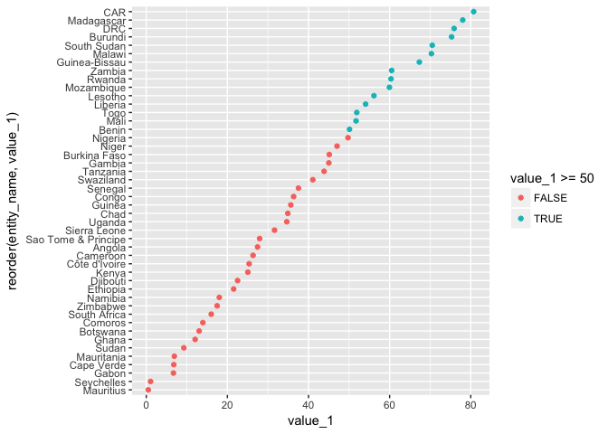
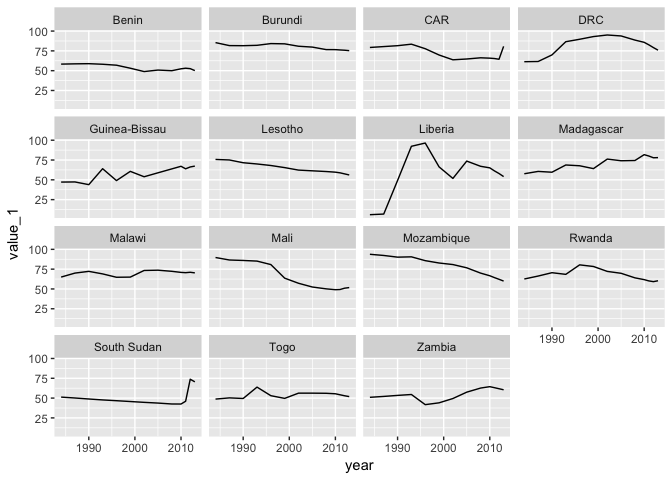

# API Highways : "2011 PPP and $1.9/day poverty line"
###### 10/4/18 - 14/4/18

This brief write-up is some simple feedback to APIHighways (re. a [Data4DevFest](https://github.com/mbeveridge/Data4DevFest) conversation) and a note of where I might go back and retry some (pipeline) things I failed at.

I wanted to see whether it was easy to use an API (instead of csv/etc file) and whether the site would be a good source of datasets to practice on. Etc etc. Chose the 1st dataset on the main page.

I wanted to use R for the analysis. As R code wasn't listed on the dataset's page, this would also be a first attempt to use Python and R in the same pipeline/notebook. 

---

Began with the `Extreme-Poverty.Rmd` RMarkdown notebook, after installing the **reticulate** package in my Anaconda setup. Importing the data failed, but solved it by `Sys.which("python")` and then specifying `use_python("/Users/markbeveridge/anaconda3/bin/python")` instead.

To reach this point (with testing) I'd also created the `Extreme-Poverty.py` script and `Extreme-Poverty.ipynb` Jupyter notebook, both of which worked for the import.

`Extreme-Poverty.Rmd` continued to fail to pass variables to a 2nd Python chunk (which is what **reticulate** was supposed to enable). `Extreme-Poverty_not-notebook.Rmd` (an RMarkdown document) also failed at this, and I haven't solved the issue yet.

---

Continued instead with `Extreme-Poverty.ipynb`, I could pass variables between Python cells, but failed to convert the JSON data into a dataframe for **pandas** (and hopefully then **dplyr** and **ggplot2**) to use. This might be due to the 'meta' data at the end [^1], but I haven't solved the issue yet.

---

Continued instead with the csv version of the dataset (`poverty-190.csv`), which doesn't have the 'meta' data, and a new RMarkdown notebook (`Extreme-Poverty_R-only.Rmd`) with only R, not Python as well.

R doesn't like `-` in column headings, so changed those. Couldn't find an definition/dictionary [^2] for the 3 numerical fields (initially `value-1`, `value-2`, `value-3`), despite going back through links and documents. It's guessable in this case (% of population), but still don't know why there are 3 separate fields [^3], as for any given row they seem to have the same value (or `value-3` is blank)

Not a lot of fields to play with, for the effort. There was also an `enity.csv` file (which the API data didn't have) [^4], which I JOINED, in order to use the `region` field. And then did a few quick visualisations, which I enjoyed. (They can be seen in the 'knitted' `Extreme-Poverty_R-only.md`, and a couple of them are on this page, below.)

Would have been more scope for regional aggregations etc if `poverty-190.csv` contained population numbers, rather than just fields calculated from them [^5]. The (apparent) [original source](http://iresearch.worldbank.org/PovcalNet/povDuplicateWB.aspx) does have them ...but not an API :)

---

_% of population below USD1.90/day poverty line in 2013, for all 46 countries in the 'south-of-sahara' region. (50% was an arbitrary choice by me) :_

_The 15 countries at 50% in 2013 (blue dots) : % of population for every year (trend) :_

---

'Feedback' links/list/footnotes :

[^1]: "This might be due to the 'meta' data at the end"
[^2]: "Couldn't find an definition/dictionary"
[^3]: "still don't know why there are 3 separate fields"
[^4]: "`enity.csv` file (which the API data didn't have)"
[^5]: "population numbers, rather than just fields calculated from them"