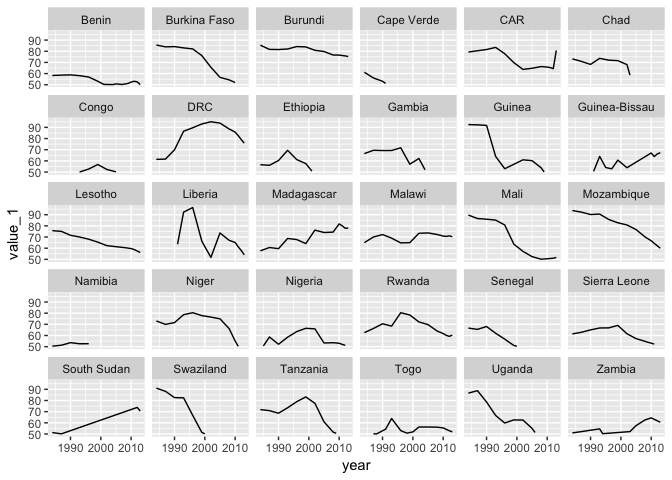

# API Highways : "2011 PPP and $1.9/day poverty line"
###### 10/4/18 - 13/4/18

My aim was to try out the site for API and data, to see the interest of datasets and possibly give feedback if asked (re Data4DevFest)

I wanted to try the analysis in R, and as R code wasn't listed on the dataset's page, this would also be a first attempt to use Python and R in the same notebook. Chose the 1st dataset on the page

Began with an `*.Rmd` RMarkdown notebook, after having installed the **reticulate** package in my Anaconda setup. Importing the data kept failing, but eventually solved this by xxxxx Anaconda3 directory

In reaching this point I also used a `*.py` script and `*.ipynb` Jupyter notebook, both of which worked

The RMarkdown notebook continued to fail to pass variables to a 2nd Python chunk (which is what **reticulate** was supposed to enable). An RMarkdown document also failed at this, and I haven't solved the issue yet

Continuing with Jupyter notebook, could pass variables between Python cells, but was ultimately unable to convert the JSON data into a dataframe for **pandas** (and hopefully then **dplyr** and **ggplot2**) to use. I think this is because of the 'meta' data at the end, which I haven't figure out how to remove yet

The csv version of the dataset doesn't have the 'meta' data

Continuing with csv and a new RMarkdown notebook (and using only R, not Python as well)....etc etc

_xxxx [R4DS\_0917](https://github.com/mbeveridge/R4DS_0917). (Note: xxxx xxxxx x xxxxxxx)_